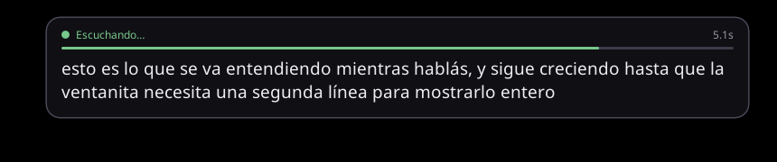
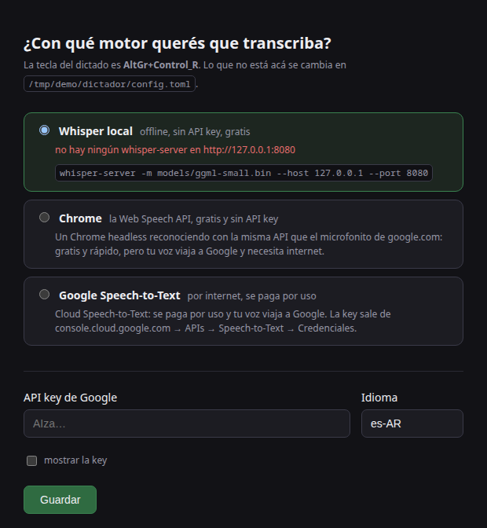

[English](README.md) · **Español**

# dictador

Dictado por voz global para Linux/X11, en Go. Mantené una tecla, hablá, soltala,
y el texto aparece donde tenías el cursor.

Es la reimplementación en Go de [dictado](https://github.com/neitanod/dictado),
que está en Python y anda. Lo que cambia acá: un binario sin venv, sin toolkit
gráfico y sin `xdotool`, `xclip` ni `xprop` —X11 se habla directo—, y un daemon
que es una máquina de estados con canales en vez de señales de Qt y tres
temporizadores.



## Instalación

Hace falta Go 1.21 o más nuevo, y `parec` (paquete `pulseaudio-utils`), que ya
viene en cualquier Ubuntu con PipeWire.

```bash
git clone https://github.com/neitanod/dictador
cd dictador
make install          # compila y deja el binario en ~/.local/bin
dictador doctor       # chequea que todo esté en su lugar
```

`make install` no toca nada del sistema: compila y copia. Para que arranque solo
en cada login, `dictador service install`.

## Uso

```bash
dictador run          # arranca el daemon y se queda escuchando la tecla
```

Con el daemon corriendo, mantené **AltGr + Control derecho**, hablá, y soltá. El
texto se pega donde estaba el cursor.

### Elegir otra combinación

```bash
dictador keys control                       # ver qué teclas hay
dictador config set hotkey.key "Menu"       # y elegir la tuya
```

Vale un nombre solo (`"Pause"`) o una combinación (`"AltGr+Control_R"`): lo
último es la tecla que dispara y lo de antes tiene que estar apretado. El orden
al apretar da igual. Hay aliases para las que nadie quiere buscar en `xmodmap`:
`AltGr`, `Ctrl`, `Alt`, `Shift`, `Super`, `RightCtrl`, `LeftCtrl`, `Menu`.

### Que las teclas sigan siendo teclas

La tecla del dictado no se agarra: se escucha por XInput2 en crudo, así que
sigue funcionando para el resto del sistema. Y para que un Control derecho de
verdad no dispare un dictado, hay un umbral: recién a los 180 ms de mantenerla
se empieza a grabar. Si mientras tanto apretás cualquier otra tecla, se cancela.

```bash
dictador config set hotkey.hold_threshold_ms 250
dictador config set hotkey.cancel_on_other_key false
```

### Qué pasa cuando soltás

| `action.on_release` | qué hace |
|---|---|
| `paste` | copia y pega en la ventana donde estabas (default) |
| `type` | teclea el texto, letra por letra |
| `clipboard` | lo deja en el portapapeles y nada más |
| `keep_open` | lo copia y deja la ventanita abierta para que lo leas |

En las terminales pega con `Ctrl+Shift+V`, que es lo que ahí funciona: se las
reconoce por su `WM_CLASS`.

### Modo toggle

Si preferís apretar una vez para arrancar y otra para cortar:

```bash
dictador config set hotkey.mode toggle
```

## Elegir motor

Hay tres, y se cambian sin reiniciar nada. Lo más cómodo es hacerle **click a la
ventanita** mientras dictás: eso corta el dictado y abre la configuración.



También desde la terminal:

```bash
dictador config web                      # la misma página, sin el daemon detrás
dictador config set stt.engine chrome
```

| motor | dónde transcribe | cuesta | texto en vivo |
|---|---|---|---|
| `faster-whisper` | en tu máquina | gratis | sí |
| `chrome` | los servidores de Google | gratis | sí |
| `google` | Google Cloud | se paga por uso | no |

### Whisper local

El default. Transcribe en tu máquina, sin API key y sin mandarle la voz a nadie.
Necesita un `whisper-server` —el que viene con
[whisper.cpp](https://github.com/ggerganov/whisper.cpp)— escuchando al lado:

```bash
whisper-server -m models/ggml-small.bin --host 127.0.0.1 --port 8080
```

El modelo queda cargado ahí, así que cada dictado cuesta una llamada HTTP local
y el texto en vivo sigue siendo barato. Si el server no está, `dictador doctor`
te dice esta misma línea.

### Chrome, o cómo dictarle gratis a Google

Google tiene dos servicios de voz con el mismo apellido. **Cloud Speech-to-Text**
es el producto comercial: API key y factura por minuto. La **Web Speech API** es
la que Chrome le da gratis a las páginas —el microfonito de google.com, el
dictado de Android— y no se puede llamar desde afuera del browser, porque las
claves van compiladas adentro de Chrome.

El motor `chrome` la usa desde adentro: levanta un Chrome headless con una página
local servida por la propia app, y esa página reconoce y devuelve el texto.

Medido en una laptop con voz natural y la misma frase:

| motor | acierto | latencia al soltar |
|---|---|---|
| `chrome` | 100% | **0,12 s** |
| `faster-whisper small` int8 | 90% | 2,22 s |

Gratis, más exacto y unas veinte veces más rápido que Whisper local, y trae los
parciales en vivo de regalo porque los emite el propio Chrome.

Lo que estás pagando: **tu voz viaja a Google**, necesita internet, y hay un
Chrome residente ocupando ~200 MB de RAM. Es un endpoint interno de Chrome, así
que si Google lo cambia, se rompe. Por eso el default sigue siendo Whisper y
elegir este motor es una decisión tuya, explícita.

```bash
dictador config set stt.engine chrome
```

### Google Cloud Speech-to-Text

Para cuando querés la calidad de Google sin un Chrome residente, y no te importa
pagarla. Necesita una API key de
[console.cloud.google.com](https://console.cloud.google.com) → APIs →
Speech-to-Text → Credenciales:

```bash
dictador config set stt.engine google
dictador config set stt.google_api_key "AIza…"
```

O por entorno, para no dejarla escrita: `GOOGLE_API_KEY`.

Este motor no dibuja texto en vivo a propósito: cada parcial sería un viaje a la
red y una llamada facturada.

## Comandos

| comando | qué hace |
|---|---|
| `dictador run` | el daemon con la tecla global |
| `dictador once` | graba una vez y escribe el texto en stdout |
| `dictador bench` | compara los motores con tu voz |
| `dictador doctor` | chequea que todo esté en su lugar |
| `dictador keys [filtro]` | lista las teclas del mapa actual |
| `dictador config [show\|init\|edit\|path\|set\|web]` | ver o editar la configuración |
| `dictador history [-n N]` | los últimos dictados |
| `dictador service [install\|uninstall\|status]` | autostart en el login |

Todos aceptan `--json`, así que la CLI se puede scriptear:

```bash
dictador once -s 5 --json | jq -r .text
dictador doctor --json | jq '.checks[] | select(.ok == false)'
```

Exit codes: `0` salió bien · `1` error · `2` error de uso · `130` cancelado con
Ctrl+C.

## Configuración

Vive en `~/.config/dictador/config.toml`. `dictador config init` lo crea con
todos los valores comentados, y `dictador config edit` lo abre en tu `$EDITOR`.

Si todavía no existe pero está el del `dictado` en Python
(`~/.config/dictado/config.toml`), se lee ese: el port arranca con la
configuración que la máquina ya tenía.

**Guardar no pisa los comentarios.** `dictador config set` edita la línea que
cambia y deja el resto del archivo intacto, incluidos los comentarios que
explican cada valor.

```toml
[hotkey]
key = "AltGr+Control_R"
mode = "hold"              # hold = push-to-talk | toggle = apretar/apretar
hold_threshold_ms = 180
cancel_on_other_key = true

[audio]
device = ""                # vacío = fuente default de PipeWire
sample_rate = 16000

[stt]
engine = "faster-whisper"  # faster-whisper | chrome | google
whisper_server_url = "http://127.0.0.1:8080"
language = "es"            # "" para autodetectar
partial_interval_ms = 900
initial_prompt = ""        # jerga o nombres propios que quieras que acierte

[action]
on_release = "paste"       # paste | type | clipboard | keep_open
restore_focus = true
trailing_space = false
strip_final_period = false

[overlay]
enabled = true
hide_delay_ms = 1400

[limits]
max_seconds = 120
min_seconds = 0.35
```

## Cómo está hecho

Casi todo es previsible. Estas cuatro no lo son, y por eso están explicadas.

**La tecla se escucha sin agarrarla.** Un atajo global del escritorio avisa del
press y nunca del release, y el push-to-talk necesita los dos. La solución es
XInput2 en crudo sobre la root window: nos enteramos de todo y la tecla sigue
sirviendo para el resto del sistema. Dos detalles que costaron: `xgb` —la
librería X11 de Go— **no trae la extensión XInput**, así que las dos peticiones
que hacen falta van armadas byte a byte; y su read loop lee los eventos de a 32
bytes fijos sin consumir el payload extra que un GenericEvent puede traer
detrás, así que el socket va envuelto en un filtro que los reencuadra. Sin eso,
el día que un teclado reporte valuadores la conexión X entera queda basura.

**Los modificadores se le preguntan a X.** Acumular presses y releases parece
más simple hasta que otra app agarra el teclado y se pierde un release: ese
modificador queda marcado como apretado para siempre. `QueryKeymap` dice cuáles
están hundidas de verdad, ahora.

**El portapapeles es del daemon.** En X, el que copió es el que sirve el
contenido cuando alguien pega. La versión Python dejaba un `xclip` vivo por
dictado; acá la app es dueña de la selección ella misma. La trampa: tomar la
selección con un timestamp posterior al reloj del servidor **se ignora en
silencio** —sin error, sin nada, el portapapeles simplemente queda vacío—, así
que la hora se le pide al servidor antes de pedirle la selección.

**El pegado va al foco real.** Mandarle el evento a una ventana puntual
significa `XSendEvent`, y media docena de toolkits descarta los eventos
sintéticos. Se activa la ventana y se teclea al foco, con los modificadores que
estén hundidos soltados primero: si soltás el dictado con AltGr todavía apretada,
un Ctrl+V sintético saldría como Ctrl+AltGr+V y no pegaría nada.

**El overlay se dibuja a mano.** Es una ventana ARGB de 32 bits
override-redirect: el gestor de ventanas no la toca, no la decora y no le da el
teclado, que es lo que hace falta para que no te robe el cursor del campo al que
le estás dictando. El cuadro se rasteriza con `x/image` —rectángulo redondeado,
texto antialiaseado con la fuente que reporte `fc-match`— y se manda con
`PutImage` en bandas de filas, porque una imagen entera de 780 píxeles de ancho
no entra en un solo pedido de X.

## Verificar que anda

```bash
bash tests/run-all.sh
```

Corre `gofmt`, `go vet`, los tests unitarios, el detector de race conditions, un
chequeo de que el overlay efectivamente dibuje (abre la ventana en cada estado y
mide que la pantalla deje de estar negra, dejando las capturas para mirarlas), y
un end-to-end sobre un display virtual (`Xvfb`) que recorre el camino completo:
mantiene la tecla, graba, transcribe contra un motor de mentira, y verifica que
el texto llegue al portapapeles **y** que el Ctrl+V sintético lo deposite en una
ventana que espera el pegado. Es la única forma de saber que el hotkey, el foco
y el pegado siguen funcionando juntos.

## Limitaciones

**X11 solamente.** En Wayland ninguna app puede escuchar el teclado global ni
tipear en otra ventana, y eso es a propósito. La salida es el portal
`GlobalShortcuts` con `layer-shell` y `libei`, y todavía no está.

**El texto en vivo depende del motor.** Con `chrome` y con `faster-whisper` se
dibuja mientras hablás; con `google` no, porque cada parcial se factura.

**La ventanita necesita un compositor.** Se dibuja sobre una ventana ARGB de 32
bits, así que en una sesión sin composición no habría transparencia. Cuando la
pantalla no ofrece un visual de 32 bits —o cuando no hay ninguna fuente
TrueType—, el daemon lo dice y cae a una notificación del escritorio que se
actualiza en el lugar.

**Whisper local necesita un server aparte.** El binario no trae el modelo
adentro: habla con un `whisper-server` por HTTP local. Meter `libwhisper` en el
binario es posible y trae CGO con él, que es lo que este port viene esquivando.
