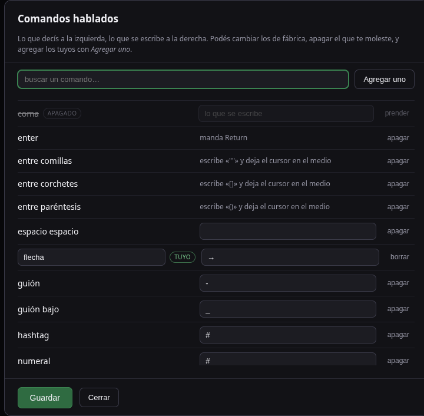
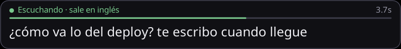
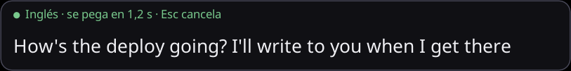
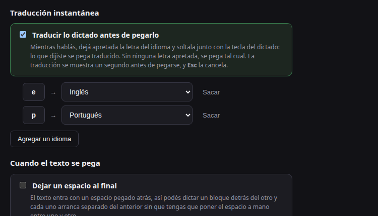

**English** · [Español](README.es.md)

# dictador

Global push-to-talk dictation for Linux/X11, in Go. Hold a key, talk, let go, and
the text lands wherever your cursor was. And if you tapped `e` while talking, it
lands in English.

This is the Go rewrite of [dictado](https://github.com/neitanod/dictado), which
is in Python and works. What changes here: a single binary with no venv, no GUI
toolkit, and no `xdotool`, `xclip` or `xprop` — X11 is spoken directly — plus a
daemon that is a state machine over channels instead of Qt signals and three
timers.


## Install

You need Go 1.21 or newer and `parec` (the `pulseaudio-utils` package), which
ships with any Ubuntu running PipeWire.

```bash
git clone https://github.com/neitanod/dictador
cd dictador
make install          # builds and drops the binary in ~/.local/bin
dictador doctor       # checks everything is where it should be
```

If you are also going to work on the code, `make link` drops a symlink to
`bin/dictador` in `~/.local/bin` instead of a copy: from then on every `make
build` is what your terminal runs, with nothing to reinstall. `make install`
warns you when it replaces a link with a copy, and `make link` warns the other
way around.

`make install` touches nothing system-wide: it builds and copies. To get it one
double click away, `dictador desktop install` drops the icon on your desktop and
the entry in your menu; to have it start on every login, `dictador service
install`. Both are also at the bottom of the configuration page.

### The desktop icon

Dictation runs with no window —nothing shows up until you press the key— which
leaves whoever installs it with no way to start it other than a terminal.
`dictador desktop install` gets that out of the way: it writes the same
freedesktop.org `.desktop` file to your desktop and to your menu, with its own
icon, and does whatever each desktop needs to treat it as a launcher rather than
a text file: the executable bit everywhere, plus the trusted mark GNOME,
Cinnamon and MATE want before they stop calling it an "untrusted application
launcher".

The desktop folder is looked up where the system declares it —`XDG_DESKTOP_DIR`,
`user-dirs.dirs`, `xdg-user-dir`— before guessing: on a Spanish session it is
called Escritorio, and an icon in `~/Desktop` is an icon nobody sees.

Copying the icon is not enough for it to show up. Plasma builds its list of icon
folders when the session starts, and `~/.local/share/icons/hicolor/scalable/apps`
only exists once somebody installs the first icon there: when that happens with
the session already running —exactly what this button does— the launcher keeps
the blank-page unknown icon until the next login, with the file in place and the
name resolving fine for any program started afterwards. The symptom is
bewildering: the icon shows up in the shortcut's Properties dialog and not on the
shortcut. So, right after copying it, dictador emits the D-Bus signal Qt
applications listen to in order to rebuild that list. Where nobody is listening,
nothing happens.

Since a launcher invites a second double click when no window ever shows up,
there is a lock: the second `dictador run` leaves without touching anything
instead of dictating alongside the first one —both would hear the key and the
text would come out twice—. Launched from the icon it also posts a desktop
notification saying it started, which is the only sign of life a program that
deliberately stays invisible can give.

## Use

```bash
dictador run          # starts the daemon and waits for the key
dictador shutdown     # and stops it
```

With the daemon running, hold **AltGr + Right Control**, talk, and let go. The
text is pasted where the cursor was.

Stopping it from the terminal that started it is a Ctrl+C, and that terminal is
exactly the one that does not exist when you started it from the icon. That is
what `dictador shutdown` is for: it finds whoever holds the lock, asks it to
leave, and waits until it is really gone. With nobody running it says so and
exits fine, so a script can call it before starting its own without checking
anything first.

### Picking another key

```bash
dictador keys control                       # see what your keyboard has
dictador config set hotkey.key "Menu"       # and pick yours
```

A single name works (`"Pause"`), and so does a combination
(`"AltGr+Control_R"`): the last one is the trigger, everything before it has to
be held down. The order you press them in doesn't matter. There are aliases for
the keys nobody wants to look up in `xmodmap`: `AltGr`, `Ctrl`, `Alt`, `Shift`,
`Super`, `RightCtrl`, `LeftCtrl`, `Menu`.

### Keeping keys as keys

The dictation key is never grabbed: it's watched through raw XInput2, so it
keeps working for the rest of the system. And so that a real Right Control
doesn't fire a dictation, there's a threshold: recording starts only after
holding it for 180 ms. Press any other key meanwhile and it cancels.

```bash
dictador config set hotkey.hold_threshold_ms 250
dictador config set hotkey.cancel_on_other_key false
```

### What happens when you let go

| `action.on_release` | what it does |
|---|---|
| `paste` | copies and pastes into the window you were in (default) |
| `type` | types the text out, character by character |
| `clipboard` | leaves it on the clipboard and nothing else |
| `keep_open` | copies it and keeps the window up so you can read it |

In terminals it pastes with `Ctrl+Shift+V`, which is what works there; they're
recognized by their `WM_CLASS`. If yours is one the built-in list doesn't know,
`dictador window` tells you its class while you stand in that window, and you
add it:

```bash
dictador config set action.terminal_classes '[my-terminal]'
```

### Toggle mode

If you'd rather press once to start and again to stop:

```bash
dictador config set hotkey.mode toggle
```

### Where the little window shows up

By default it comes up at the bottom center of the screen the mouse is on, which
is where you're looking. Pick it in the configuration, or from the terminal:

```bash
dictador config set overlay.screen focus          # the screen with the window you're using
dictador config set overlay.position top-right    # and in its top right corner
```

| `overlay.screen` | where |
|---|---|
| `mouse` | the screen the pointer is on (default) |
| `focus` | the screen with the window you're using |
| `primary` | always the primary one |
| `all` | on every screen at once |
| `HDMI-1`, `eDP-1`… | always that one, by output name |

`overlay.position` takes the four corners — `top-left`, `top-right`,
`bottom-left`, `bottom-right` —, the two centered ones — `top-center`,
`bottom-center` — and `center`.

`dictador doctor` lists the connected screens and tells you which one it will
show up on right now.

The text size lives in `overlay.font_size`, in **points**, like in any other
program: it's rasterized at whatever DPI your screen declares, so 19 points here
look as big as 19 points anywhere else on your desktop.

```bash
dictador config set overlay.font_size 22
```

## Punctuation and spoken commands

Some things aren't dictated: they're written. Saying "abre pregunta cómo andás
signo de pregunta" has to come out as `¿cómo andás?`, and saying "entre
corchetes" has to leave the cursor **between** the two brackets, ready for
whatever comes next.

The commands are Spanish phrases, because that's the language this thing was
built to dictate in — see the table below.

```
abre pregunta cómo va lo del deploy signo de pregunta punto y aparte
   → ¿cómo va lo del deploy?
     (and the cursor on the next line)

el archivo está en config barra dictador barra config punto toml
   → el archivo está en config/dictador/config.toml
```

**The little window shows them applied as you speak**: say "abre pregunta" and
the `¿` shows up there, say "punto y aparte" and the text drops a line. What you
read is what's going to be written.

`dictador commands` lists them all, and `--try` runs a phrase through them
without touching the microphone:

```bash
dictador commands
dictador commands --try "entre corchetes nota barra dos"
```

| what you say | what happens |
|---|---|
| `punto y aparte` | `.` and a new line |
| `punto y seguido` · `punto final` | `.` |
| `coma` · `palabra coma` | `,` |
| `punto y coma` | `;` |
| `abre pregunta` · `signo de pregunta` | `¿` · `?` |
| `abre admiración` · `signo de admiración` | `¡` · `!` |
| `entre corchetes` · `entre paréntesis` · `entre comillas` | writes the pair and leaves the cursor inside |
| `enter` · `tab` | the actual key, not the character |
| `guión` · `guión bajo` · `barra` · `barra invertida` | `-` · `_` · `/` · `\` |
| `signo pesos` · `numeral` · `hashtag` · `asterisco` | `$` · `#` · `#` · `*` |
| `signo más` · `signo igual` · `signo mayor` · `signo menor` · `ampersand` | `+` · `=` · `>` · `<` · `&` |
| `espacio espacio` | two spaces, which in Markdown is a line break |
| `borrar palabra` | deletes the last word you dictated |
| `borrá eso` | deletes everything you had dictated so far |

Spacing sorts itself out: the comma sticks to the word before it, the `¿` to the
word after it, and the slash to both — which is what turns "config barra
dictador" into a path instead of three words.

**A command is a phrase you only say when you're talking about editing text.**
That's why `signo mayor` exists and `mayor` doesn't, and `espacio espacio` does
and `espacio` doesn't: "el alfajor Capitán del Espacio es muy rico" has to come
out untouched. If one still gets in your way — `coma` and `barra` are everyday
words — you can turn it off without touching code.

`punto final` is the exception, and it was asked for on purpose: dictating, it
comes up far more often as a request for a period than as a way to close a
matter. The cost is that "le puso punto final al asunto" comes out cut short,
and whoever prefers it the other way turns it off from the window.

**Yours get added from the configuration page.** The *Editar los comandos…*
button opens a window with the whole table — the built-in ones and yours — where
you change what any of them writes, turn one off, or add the one you're missing.
It's one row and it's working, with nothing to restart.



The ones that send keys or delete — `enter`, `entre corchetes`, `borrá eso` —
show up but can't be edited: what they do isn't text, and no config value would
write it. Turning them off does work.

It's the same config.toml, and by hand it looks like this:

```toml
[commands]
enabled = true

[commands.replacements]
"dos puntos" = ":"
"flecha" = "→"
"coma" = ""        # turn off a built-in one
```

Spacing for yours is inferred from the value: starting with a closing sign
sticks it to the previous word, ending with an opening one sticks it to the
next, and if you write the spaces yourself, yours are kept.

Deletions only reach what you dictated in that same dictation. "borrá eso" said
before saying anything does nothing: the text already in your editor wasn't
written by the dictation, and it isn't its to delete. "borrar palabra" is the one
exception — with nothing dictated yet it sends `Ctrl+Backspace`, which is what
fixing the previous word needs.

## Instant translation

While you talk, tap a letter and what you said gets pasted translated. `e` makes
it English and `p` makes it Portuguese, and you pick both the letters and the
languages.

```
AltGr+Control_R  ──────────────────────────▶ pasted in Spanish
AltGr+Control_R, you tap e  ───────────────▶ pasted in English
AltGr+Control_R, you tap e then e  ────────▶ pasted in Spanish again
AltGr+Control_R, you tap e then p  ────────▶ pasted in Portuguese
```

**The letter is a switch, not a button you hold down.** One tap turns it on,
another turns it off, and a different letter overrides the previous one: you can
start talking without having decided anything and tap it near the end, or change
your mind mid-sentence and tap it again. While you dictate, the overlay shows
where it is headed — "Escuchando · sale en inglés" — so it is never blind.

**Every dictation starts with no language.** Whatever you picked last time does
not carry over: a dictation that comes out translated without anyone asking is
discovered after it is pasted.



**The letter is not typed anywhere.** While recording, those keys are held by a
X grab: they never reach the app in front, and they never fire its shortcut —
`Ctrl+E` in a browser opens the search bar. Outside dictation they are ordinary
keys again.

### The second to change your mind

A translation can come out wrong, and noticing after it landed in the chat is
too late. So the translated text is shown in the overlay for a moment before
being pasted:

- **`Esc`** cancels the paste and leaves the translation in the clipboard, in
  case you wanted it anyway.
- **The dictation key** approves it and pastes it right away.
- Do nothing and it pastes itself when the time runs out.



That moment is `translate.preview_ms`, 1200 by default; `0` pastes straight
through. Dictation that was not translated pastes immediately, as always.

### What translates it

Google Translate does, from the same Chrome that is listening to you. **No API
key and no bill**, same as the dictation.

Hence the one restriction: **it only works with `engine = "chrome"`**. Whisper
transcribes locally and has nothing to translate with, and with Google Cloud
every call is billed — putting a paid service under a key is an expensive
surprise. With those two engines the section shows up disabled in the settings
and the letters do nothing.

The source language is detected automatically, so dictating in English and
asking for Portuguese works too, without touching the recognition language.

**Spoken commands run before translating.** They are spoken in Spanish, and
sending "coma" to the translator would return the word *comma* spelled out
instead of the sign.

**If the translator does not answer**, what you said gets pasted with a note
next to it. Dictation is never lost because of the translation.

### Where the translation comes from

Google has two translators, and they do not translate alike:

| | what it returns | how long |
|---|---|---|
| **`web`** (default) | *Tomorrow I'm going to be a wreck* | ~1 second |
| `api` | *Tomorrow I'm going to be shit* | ~300 ms |

The first is translate.google.com's, the one that translates for meaning. The
second is the public endpoint apps and extensions use, which translates word by
word. Pick with `translate.mode`.

**And with `web`, the endpoint stays as a safety net.** If the page does not
answer, the dictation is pasted anyway — translated the other way — with a note
next to it. You never lose text because of the translator.

Getting the first one had its trick, worth knowing before touching this part:
**Google picks which one you get based on how much you look like a real
browser.** Two things give it away:

- **The browser claiming to be headless in its User-Agent.** Fixed by handing it
  a desktop Chrome one — same binary, different name.
- **Letting Chrome pick the port it is driven through.** Asking for the port
  with a zero — what every automation tool does — turns on a flag inside saying
  it is being driven, Google reads it and serves you the old translator. With
  the port picked in advance, that flag stays off.

That open port has a consequence that had to be handled separately: **Chrome
stops closing itself when its last tab closes.** Dictation already knew how to
close its own Chrome when the dictator died badly — the page notices nobody is
answering and closes itself — and with the port open that left a whole browser
alive. So the page, besides closing, asks the browser to close too: the address
for asking comes embedded in the page, and Chrome accepts it because at launch
it is told to trust that origin and no other.

**What to know about that port:** while dictation runs, that Chrome listens on a
loopback port through which it can be driven entirely. It is a dedicated Chrome,
with none of your sessions or cookies, and the port never leaves the machine —
but any program running as your user can talk to it. If that bothers you,
`translate.mode = "api"` opens no port at all: you lose the meaning-aware
translation and keep the literal one.

That is why the translation comes from the page and not from an API: text goes
into the box on the left and the result is read on the right, exactly what a
person does. The endpoint returns the old model even when called from inside
Google's own page: it is missing an anti-fraud token that Google's JavaScript
builds for its own requests.

### Picking letters and languages

The settings screen has a table: a letter on the left, the language on the
right, and *Agregar un idioma* to add more.



Or in the file:

```toml
[translate]
enabled = true
mode = "web"               # web = like translate.google.com | api = the endpoint
preview_ms = 1200          # how long it shows before pasting
timeout_s = 20             # if the translator takes longer, your words go in

[translate.keys]
e = "en"
p = "pt"
f = "fr"
j = "ja"
```

Codes are Google Translate's: `en`, `pt`, `fr`, `it`, `de`, `ja`, `zh-CN`… The
settings screen offers 31, and any missing one written here by hand works just
the same.

`dictador doctor` tells you how it ended up: which language each letter points
to, whether your engine can translate, and whether some letter is missing from
your keyboard.

## Picking an engine

There are three, and switching costs no restart. The comfortable way is to
**click the little window** while you're dictating: that cuts the dictation short
and opens the configuration.


From the terminal too:

```bash
dictador config web                      # the same page, without the daemon
dictador config web --no-open            # serve it and print the URL, no window
dictador config set stt.engine chrome
```

| engine | where it transcribes | cost | live text |
|---|---|---|---|
| `faster-whisper` | on your machine | free | yes |
| `chrome` | Google's servers | free | yes |
| `google` | Google Cloud | pay per use | no |

### Local Whisper

The default. Transcribes on your machine, no API key, your voice goes nowhere.
It needs a `whisper-server` — the one that ships with
[whisper.cpp](https://github.com/ggerganov/whisper.cpp) — listening alongside:

```bash
whisper-server -m models/ggml-small.bin --host 127.0.0.1 --port 8080
```

The model stays loaded there, so each dictation costs one local HTTP call and
live text stays cheap. If the server isn't up, `dictador doctor` hands you this
exact line.

### Chrome, or how to dictate to Google for free

Google has two speech services sharing a surname. **Cloud Speech-to-Text** is the
commercial product: API key, billed per minute. The **Web Speech API** is the one
Chrome hands to web pages for free — the little microphone on google.com,
Android's dictation — and it can't be called from outside the browser, because
the keys are compiled into Chrome.

The `chrome` engine uses it from the inside: it launches a headless Chrome on a
local page served by the app itself, and that page recognizes and returns the
text.

Measured on a laptop, natural voice, same sentence:

| engine | accuracy | latency on release |
|---|---|---|
| `chrome` | 100% | **0.12 s** |
| `faster-whisper small` int8 | 90% | 2.22 s |

Free, more accurate and about twenty times faster than local Whisper, and it
throws in live partials because Chrome emits them itself.

What you're paying: **your voice travels to Google**, it needs internet, and a
resident Chrome eats ~200 MB of RAM. It's an internal Chrome endpoint, so if
Google changes it, it breaks. That's why the default is still Whisper and
choosing this engine is your call, explicitly.

```bash
dictador config set stt.engine chrome
```

### Google Cloud Speech-to-Text

For when you want Google's quality without a resident Chrome and don't mind
paying for it. Needs an API key from
[console.cloud.google.com](https://console.cloud.google.com) → APIs →
Speech-to-Text → Credentials:

```bash
dictador config set stt.engine google
dictador config set stt.google_api_key "AIza…"
```

Or through the environment, to keep it out of a file: `GOOGLE_API_KEY`.

This engine draws no live text on purpose: every partial would be a network trip
and a billed call.

## Commands

| command | what it does |
|---|---|
| `dictador run` | the daemon with the global key |
| `dictador shutdown` | stops the one that is running |
| `dictador once` | records once and writes the text to stdout |
| `dictador bench` | compares the engines using your voice |
| `dictador doctor` | checks everything is where it should be |
| `dictador keys [filter]` | lists the keys in the current map |
| `dictador window [-w N]` | what the dictator sees in the window in front, and how it would paste |
| `dictador commands [--try "phrase"]` | lists the spoken commands, or runs a phrase through them |
| `dictador config [show\|init\|edit\|path\|set\|web]` | view or edit the configuration |
| `dictador history [-n N]` | the last dictations |
| `dictador desktop [install\|uninstall\|status]` | desktop icon and menu entry |
| `dictador service [install\|uninstall\|status]` | autostart on login |

They all take `--json`, so the CLI can be scripted:

```bash
dictador once -s 5 --json | jq -r .text
dictador doctor --json | jq '.checks[] | select(.ok == false)'
```

Exit codes: `0` fine · `1` error · `2` usage error · `130` cancelled with Ctrl+C.

## Configuration

It lives in `~/.config/dictador/config.toml`. `dictador config init` creates it
with every value commented, and `dictador config edit` opens it in your
`$EDITOR`. On the configuration screen the path is a link: clicking it opens the
file with whatever editor you have — `$VISUAL` or `$EDITOR` first, and if they
say nothing, the text editor that happens to be installed.

If it doesn't exist yet but the Python `dictado` one does
(`~/.config/dictado/config.toml`), that one is read: the port starts with the
configuration the machine already had.

**Saving doesn't clobber the comments.** `dictador config set` edits the line
that changes and leaves the rest of the file alone, comments included.

**The file is re-read on its own.** The daemon watches the config.toml while it
runs, and a second after you save it is already working with the new values: the
engine is rebuilt if anything under `[stt]` changed, and the little window moves
if you changed its screen or position. Three things are grabbed once at startup
— the hotkey, the microphone and whether the window exists at all — and those it
tells you to restart for. A syntax error is reported and the old configuration
keeps running, and if you were dictating when you saved, the re-read waits until
you're done.

```toml
[hotkey]
key = "AltGr+Control_R"
mode = "hold"              # hold = push-to-talk | toggle = press/press
hold_threshold_ms = 180
cancel_on_other_key = true

[audio]
device = ""                # empty = PipeWire's default source
sample_rate = 16000

[stt]
engine = "faster-whisper"  # faster-whisper | chrome | google
whisper_server_url = "http://127.0.0.1:8080"
language = "es"            # "" to autodetect
partial_interval_ms = 900
initial_prompt = ""        # jargon or proper nouns you want it to get right

[action]
on_release = "paste"       # paste | type | clipboard | keep_open
restore_focus = true
trailing_space = false     # also a checkbox in the settings page
strip_final_period = false

[overlay]
enabled = true
screen = "mouse"           # mouse | focus | primary | all | "HDMI-1"
position = "bottom-center" # the 4 corners, top/bottom-center, or center
font_size = 19             # in points, at your screen's DPI
hide_delay_ms = 1400

[limits]
max_seconds = 120
min_seconds = 0.35

[commands]
enabled = true             # spoken commands: "coma", "entre corchetes"…

[commands.replacements]
# "dos puntos" = ":"       # yours; an empty value turns off a built-in one

[translate]
enabled = true             # translate based on the letter you tap while talking
mode = "web"               # web = like translate.google.com | api = the endpoint
preview_ms = 1200          # the moment to read it and cancel with Esc
timeout_s = 20

[translate.keys]
e = "en"                   # the letter you tap → the language it goes to
p = "pt"
```

## How it's built

Most of it is unsurprising. These four aren't, which is why they're written down.

**The key is watched without grabbing it.** A desktop global shortcut tells you
about the press and never about the release, and push-to-talk needs both. The
answer is raw XInput2 on the root window: we hear everything and the key keeps
serving the rest of the system. Two details that cost time: `xgb` — Go's X11
library — **doesn't ship the XInput extension**, so the two requests we need are
assembled byte by byte; and its read loop reads events in fixed 32-byte chunks
without consuming the extra payload a GenericEvent may carry behind it, so the
socket is wrapped in a filter that reframes them. Without that, the day a
keyboard reports valuators the whole X connection turns to garbage.

**Modifiers are asked of X.** Accumulating presses and releases looks simpler
until another app grabs the keyboard and a release goes missing: that modifier
stays marked as held forever. `QueryKeymap` says which keys are actually down,
right now.

**With the key grabbed, the release never comes back.** The letter that picks
the language is grabbed while you dictate so it does not leak into the app in
front, and with the grab in place X delivers the press and never the release.
Telling a fresh tap from the repeat X sends on its own while you hold the key
cannot be done by tracking what is pressed: it is done with the flag the event
itself carries, saying whether a finger or the auto-repeat produced it.

**The clipboard belongs to the daemon.** In X, whoever copied is the one who
serves the content when someone pastes. The Python version left an `xclip`
process alive per dictation; here the app owns the selection itself. The trap:
claiming the selection with a timestamp later than the server's clock **is
ignored silently** — no error, nothing, the clipboard just comes up empty — so
the time is asked of the server before the selection is.

**Pasting goes to the real focus.** Sending the event to a specific window means
`XSendEvent`, and half a dozen toolkits discard synthetic events. The window is
activated and the keys are typed at the focus, with any held modifiers released
first: if you let go of the dictation key with AltGr still down, a synthetic
Ctrl+V would come out as Ctrl+AltGr+V and paste nothing.

**The overlay is painted by hand.** It's a 32-bit ARGB override-redirect window:
the window manager doesn't touch it, doesn't decorate it and doesn't give it the
keyboard, which is what it takes for it not to steal the cursor from the field
you're dictating into. The frame is rasterized with `x/image` — rounded
rectangle, antialiased text in whatever font `fc-match` reports — and shipped
with `PutImage` in bands of rows, because a whole 780-pixel-wide image doesn't
fit in a single X request.

**A point isn't a pixel.** Text size is written in points, and a point is 1/72
of an inch: turning that into pixels means knowing how many fit in an inch of
this screen. Rasterizing at 72 DPI — the number you reach for without thinking —
treats one point as one pixel and leaves the text 25% smaller than any toolkit
would draw it. The DPI comes from `Xft.dpi`, which is what Qt and GTK read, and
failing that from the physical dimensions the server reports. Everything else in
the frame scales with it: if only the text grew, it would eat the margin.

**Screens aren't "screens".** On X11 all your monitors live inside a single
logical screen, glued into one big rectangle, so `Screen.WidthInPixels` is the
whole desktop. Centering the little window there on a three-monitor setup splits
it down the middle, right over the seam between two of them. Which monitor is
which — and where it starts — is something RandR knows, and that's where the
choice of screen comes from.

## Checking that it works

```bash
bash tests/run-all.sh
```

Runs `gofmt`, `go vet`, the unit tests, the race detector, a check that the
overlay actually paints (it opens the window in each state and measures that the
screen stops being black, leaving the screenshots behind to look at), and an
end-to-end pass on a virtual display (`Xvfb`) that walks the whole path: holds the key, records,
transcribes against a fake engine, and verifies the text reaches the clipboard
**and** that the synthetic Ctrl+V drops it into a window waiting for a paste.
It's the only way to know the hotkey, the focus and the paste still work
together.

Last on the list is the one for the letter that picks the language: it dictates
while holding `e`, checks the dictation comes out marked for translation, and —
what matters most — that the `e` never reached the window in front. Then it
repeats it with translation off, where the letter does have to arrive: without
that second half, the first one could be passing for any reason at all.

## Limitations

**X11 only.** On Wayland no app can watch the global keyboard or type into
another window, and that's by design. The way out is the `GlobalShortcuts`
portal with `layer-shell` and `libei`, and it isn't there yet.

**Live text depends on the engine.** With `chrome` and with `faster-whisper` it's
drawn while you talk; with `google` it isn't, because every partial is billed.

**The little window needs a compositor.** It's painted on a 32-bit ARGB window,
so a session without compositing would get no transparency. When the screen
offers no 32-bit visual — or when there's no TrueType font around — the daemon
says so and falls back to a desktop notification that updates in place.

**Local Whisper needs a separate server.** The binary doesn't carry the model:
it talks to a `whisper-server` over local HTTP. Putting `libwhisper` inside the
binary is possible and brings CGO along with it, which is what this port has been
dodging.
